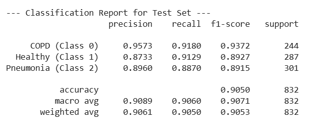

# Hybrid Quantum-Classical Neural Network for Respiratory Disease Classification

*Authors:* Goteti Sai Abhinav, Meka Janaki Ram, Boppudi Aashrith

This project implements a **hybrid classical-quantum neural network** to detect respiratory diseases using **lung sound signals**. We used the ICBHI 2017 dataset and applied advanced audio preprocessing and data augmentation, followed by classification using quantum circuits integrated with deep learning.

## Motivation

Early diagnosis of respiratory illnesses is crucial due to their high global mortality rate. Traditional methods often rely on manual auscultation. This project automates the classification of lung diseases based on sound signals using quantum machine learning.

## Dataset

- **Source**: ICBHI 2017 Challenge Dataset or Respiratory Sound Database from Kaggle  
- **Patients**: 126  
- **Audio Files**: 920 
- **Diagnosis Classes**: 6 but taken only 3 (COPD, Healthy, Pneumonia)

Each audio file ranges from 10–90 seconds and has varying sampling rates.
**Main problem with the dataset:** class imbalance 

## Data Preprocessing
- **Snippet Generation**: Break long files into smaller time (6-sec) segments or snippets that contain crackles or wheezes.
- **Baseline or DC Wandering Removal** using Discrete Fourier Transform (0–1 Hz noise eliminated)

## Data Augmentation

To balance classes, we applied a **MLP based Variational Auto-Encoder (VAE)**.

The architecture of the MLP-VAE is detailed as follows:

- Encoder: It consists of 3 dense layers. The third layer specifically generates the mean and log variance vectors for the latent space. The inclusion of the log variance layer simplifies the computation of KL loss and re-parameterization.
- Decoder: It comprises 2 intermediate dense layers and an output layer that takes samples from the latent vector **z** to reconstruct a Mel spectrogram.
- Latent Dimension: The size of the latent dimension is 2.
- Activation Functions: ReLU is used for the intermediate layers, and sigmoid is used for the output layer.
- Optimizer: Adam optimizer is employed for training the MLP-VAE.

A new object of model was instantiated and trained for each minority class separately.

After training, synthetic Mel spectrograms are generated by the decoder network using a latent vector **z** sampled from a standard normal distribution. 
The MLP-VAE generated around 5500  synthetic samples (total) for all non-COPD classes. It was able to generate high-quality and highly similar synthetic samples for the Pneumonia classes (cross-correlation ~0.70).
  

## Model Architecture

A **3-stage hybrid model**:

1. **Feature Extraction**  
   - Convolutional + MaxPooling layers for extracting spatial features

2. **Quantum Processing**  
   - 4-qubit quantum circuit (16 outputs as probabilities)  
   - Features encoded as rotation angles (θ₀ to θ₇) for quantum gates

3. **Classification**  
   - Fully connected layer maps quantum output to disease probabilities using softmax

## Quantum Circuit Design

Details:
- Each of the 4 qubits is rotated using 2 parameters
- Final measurement yields 16-dimensional probability vector
- Example output: `P(|0110⟩)` = Probability that 2nd and 3rd qubit are in state |1⟩

## Results

  
## Tools & Technologies

- **Language**: Python  
- **Libraries**: NumPy,librosa, Matplotlib, Pandas
- **Deep Learning framework**: PyTorch  
- **Quantum ML**: Qiskit
- **Concepts**: Variational Auto Encoder, MLP, Parameterized Quantum Circuit (PQC), Paramter-shift rule, Quantum gates( Hadamard, RX,RY,RZ, CNOT)

